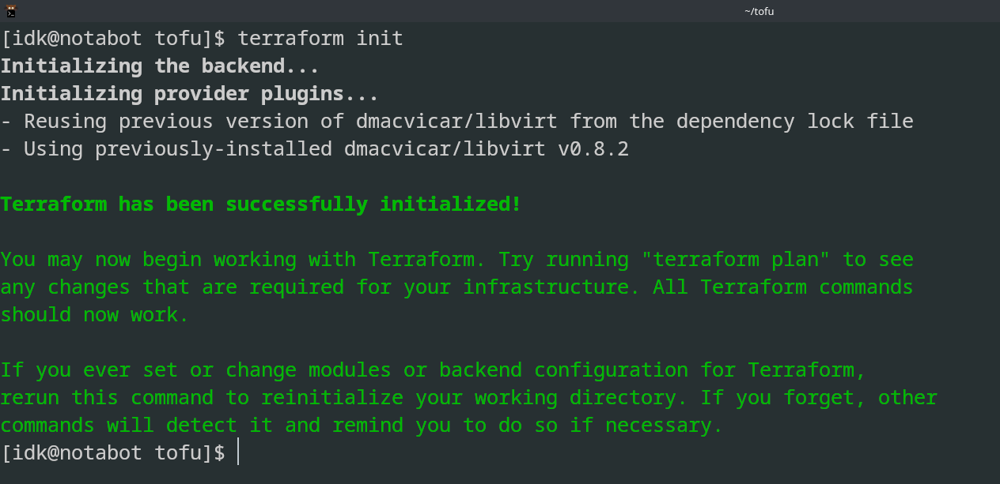
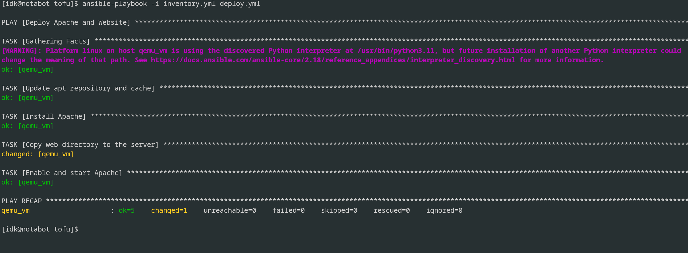
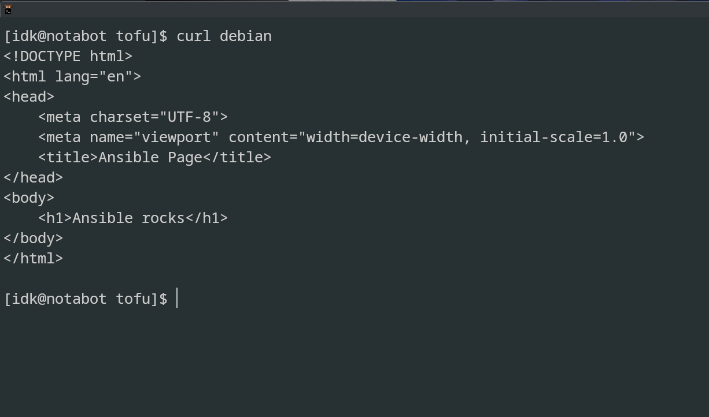

# Práctica RA5.2: IaC con Terraform y Ansible sobre libvirtd

Este repositorio contiene la solución a la práctica RA5.2 de **Ciberseguridad en entornos de TI**, donde se han aplicado los principios de **Infraestructura como Código (IaC)** para aprovisionar y configurar una máquina virtual Ubuntu 24.04, usando **Terraform** y **Ansible**, pero con **libvirtd/KVM** en lugar de VirtualBox. :contentReference[oaicite:0]{index=0}:contentReference[oaicite:1]{index=1}

---

## Índice

1. [Introducción](#introducción)  
2. [Objetivos](#objetivos)  
3. [Estructura del repositorio](#estructura-del-repositorio)  
4. [Requisitos](#requisitos)  
5. [Provisionamiento con Terraform (Ejercicio 3.1)](#provisionamiento-con-terraform-ejercicio-31)  
6. [Configuración con Ansible (Ejercicios 3.2 y 3.3)](#configuración-con-ansible-ejercicios-32-y-33)  
7. [Validación y capturas](#validación-y-capturas)  
8. [Bibliografía](#bibliografía)  

---

## Introducción

La **Infraestructura como Código (IaC)** permite definir y gestionar entornos de TI de forma reproducible y auditable, eliminando la intervención manual y reduciendo errores humanos.  
- **Terraform** se utiliza para el aprovisionamiento declarativo de recursos (en este caso, una VM Ubuntu 24.04 sobre libvirtd).  
- **Ansible** automatiza la configuración y gestión del sistema operativo y servicios dentro de la VM. :contentReference[oaicite:2]{index=2}:contentReference[oaicite:3]{index=3}

## Objetivos

- **RA5**: Implantar sistemas seguros de despliegue de software, utilizando herramientas de automatización.  
- **3.1** Provisionar una VM Ubuntu 24.04.
- | |
  
- **3.2** Configurar el sistema: `update & upgrade` + instalación de Apache.
- | |

- **3.3** Desplegar contenido web (`index.html`) y verificar su acceso. :contentReference[oaicite:4]{index=4}:contentReference[oaicite:5]{index=5}
- | |

